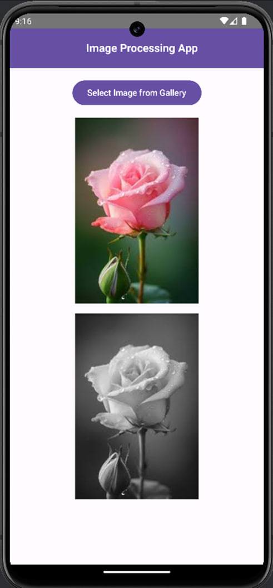
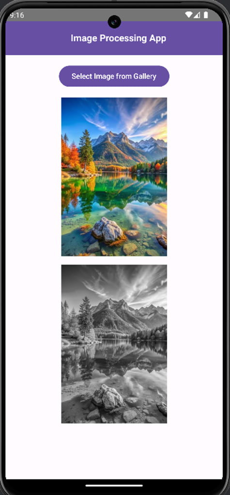
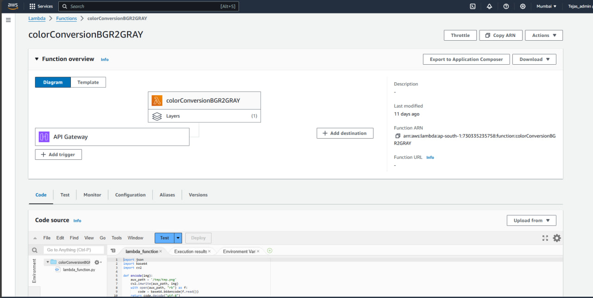
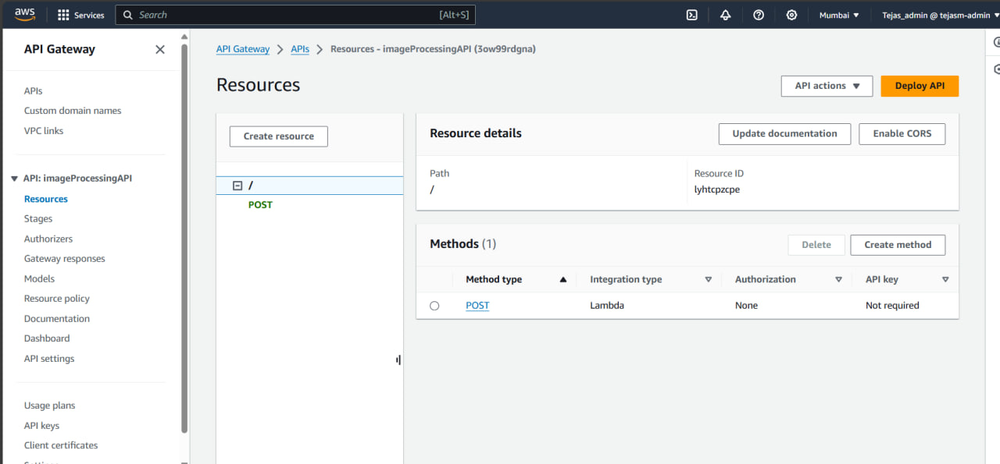

# Image Processing Android App

The Image Processing Android App is a mobile application designed to process images by converting them to grayscale using a backend API. This app leverages Jetpack Compose for UI development and integrates with an image processing API hosted on AWS.

## Features

- **Select Image**: Users can select images from their gallery.
- **Convert to Grayscale**: Automatically converts selected images to grayscale.
- **Display Results**: Shows the processed grayscale image.

## API Integration

It uses the Image processing API deployed on AWS API Gateway and Lambda function.

## Screenshots

Here are some screenshots of the application and the API in action:

  
  

  
  

